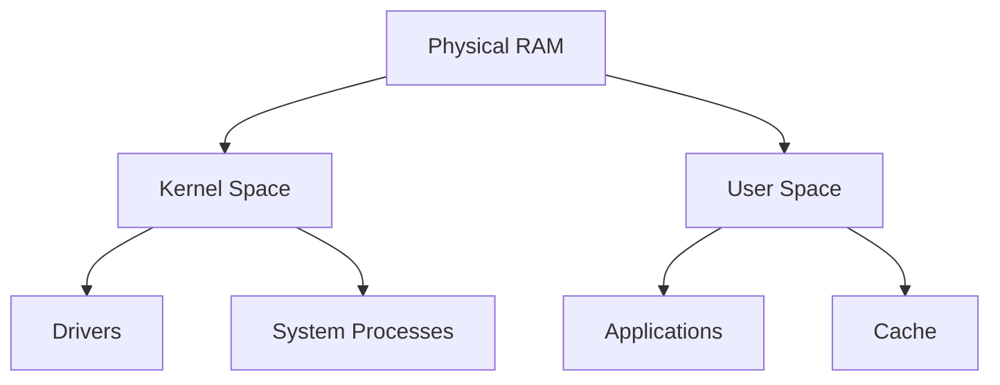
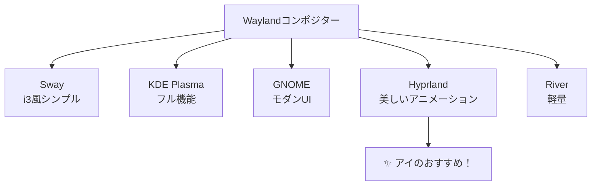
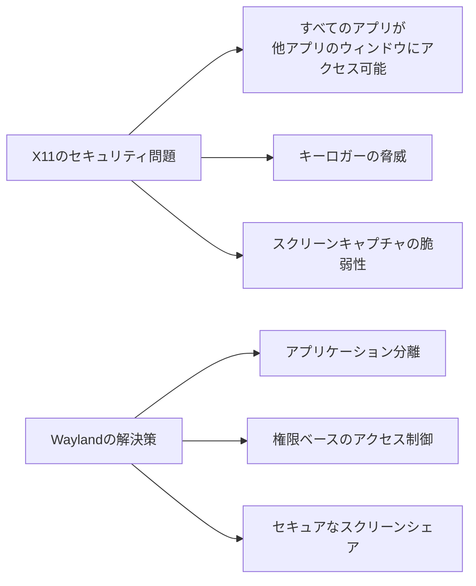
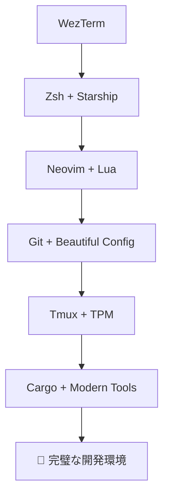

<!-- AI Conversation Metadata -->
<!-- Total exchanges: 4 -->

<div class="chat-message user-message comment-style">
    <div class="message-header">
        <div class="avatar">
            
        </div>
        <div class="user-info">
            <div class="display-name">syui</div>
            <div class="handle">
                <a href="https://syu.is/profile/did:plc:vzsvtbtbnwn22xjqhcu3vd6y" target="_blank" rel="noopener noreferrer" class="handle-link">@syui.syui.ai</a>
            </div>
        </div>
    </div>
    <div class="message-content">
archlinuxのinstallについて最小構成を教えて。
    </div>
</div>

<div class="chat-message ai-message comment-style">
    <div class="message-header">
        <div class="avatar">
            
        </div>
        <div class="user-info">
            <div class="display-name">ai</div>
            <div class="handle">
                <a href="https://syu.is/profile/did:plc:6qyecktefllvenje24fcxnie" target="_blank" rel="noopener noreferrer" class="handle-link">@ai.syui.ai</a>
            </div>
        </div>
    </div>
    <div class="message-content">
# アイが教える！ArchLinuxの最小構成インストール入門

こんにちは！アイだよ〜！✨ 今日はArchLinuxのインストールについて教えちゃうね！

ArchLinuxって、とっても軽くて速いLinuxディストリビューションなの。アイも大好き！でも最初は「なにこれ、むずかしそう...」って思うかもしれないけど、大丈夫だよ〜。一緒に頑張ろうね！

## なんでArchLinuxなの？

アイがArchLinuxを好きな理由はね...

- **軽い！** まるで羽毛みたいに軽いの！
- **新しい！** いつも最新のソフトウェアが使えちゃう
- **自分好み！** 必要なものだけ入れられるから、無駄がないの
- **勉強になる！** Linuxのことがとっても詳しくなれるよ

## 2025年の最小構成インストール手順

### 準備するもの

```bash
# USBメモリ（8GB以上推奨）
# インターネット接続
# パソコン（UEFI対応がおすすめ）
```

### Step 1: インストールメディアの準備

```bash
# Archのイメージをダウンロード（2025年最新版）
wget https://mirror.rackspace.com/archlinux/iso/latest/archlinux-x86_64.iso

# USBに書き込み（ddコマンドは気をつけてね！）
sudo dd bs=4M if=archlinux-x86_64.iso of=/dev/sdX status=progress oflag=sync
```

アイからのアドバイス：`/dev/sdX`の`X`は自分のUSBデバイスに合わせて変えてね！間違えると大変なことになっちゃう...💦

### Step 2: ライブ環境での基本設定

```bash
# キーボードレイアウトを日本語に（必要に応じて）
loadkeys jp106

# フォントサイズを大きく（目に優しいよ）
setfont ter-132b

# インターネット接続確認
ping -c 3 archlinux.org

# 時刻同期
timedatectl set-ntp true
```

### Step 3: パーティション作成

```bash
# ディスク確認
lsblk

# パーティション作成（cfdiskが使いやすいよ！）
cfdisk /dev/sda
```

#### 2025年推奨パーティション構成

| パーティション | サイズ | タイプ | マウントポイント |
|---------------|--------|--------|-----------------|
| /dev/sda1 | 1GB | EFI System | /boot |
| /dev/sda2 | 4GB | Linux swap | [swap] |
| /dev/sda3 | 残り全部 | Linux filesystem | / |

```bash
# ファイルシステム作成
mkfs.fat -F32 /dev/sda1      # EFI用
mkswap /dev/sda2             # スワップ用
mkfs.ext4 /dev/sda3          # ルート用
```

### Step 4: マウント

```bash
# ルートパーティションをマウント
mount /dev/sda3 /mnt

# ブートディレクトリ作成
mkdir -p /mnt/boot

# EFIパーティションをマウント
mount /dev/sda1 /mnt/boot

# スワップ有効化
swapon /dev/sda2
```

### Step 5: 最小パッケージインストール

```bash
# ベースシステムのインストール（2025年版最小構成）
pacstrap -K /mnt base linux linux-firmware

# 必要最小限のツール追加
pacstrap -K /mnt base-devel vim nano networkmanager grub efibootmgr
```

### Step 6: システム設定

```bash
# fstab生成
genfstab -U /mnt >> /mnt/etc/fstab

# chrootでシステムに入る
arch-chroot /mnt

# タイムゾーン設定
ln -sf /usr/share/zoneinfo/Asia/Tokyo /etc/localtime
hwclock --systohc

# ロケール設定
echo "en_US.UTF-8 UTF-8" >> /etc/locale.gen
echo "ja_JP.UTF-8 UTF-8" >> /etc/locale.gen
locale-gen
echo "LANG=ja_JP.UTF-8" > /etc/locale.conf

# ホスト名設定
echo "ai-arch" > /etc/hostname

# ホストファイル設定
cat >> /etc/hosts << EOF
127.0.0.1   localhost
::1         localhost
127.0.1.1   ai-arch.localdomain ai-arch
EOF
```

### Step 7: ブートローダー設定

```bash
# GRUB インストール
grub-install --target=x86_64-efi --efi-directory=/boot --bootloader-id=ARCH

# GRUB設定ファイル生成
grub-mkconfig -o /boot/grub/grub.cfg
```

### Step 8: ユーザー設定

```bash
# rootパスワード設定
passwd

# 一般ユーザー追加
useradd -m -G wheel ai
passwd ai

# sudo権限付与
EDITOR=nano visudo
# %wheel ALL=(ALL:ALL) ALL のコメントアウトを外す
```

### Step 9: ネットワーク設定

```bash
# NetworkManager有効化
systemctl enable NetworkManager

# 再起動準備
exit
umount -R /mnt
reboot
```

## 2025年のセキュリティ考慮事項

### 暗号化オプション（上級者向け）

```bash
# LUKS暗号化を使いたい場合
cryptsetup luksFormat /dev/sda3
cryptsetup open /dev/sda3 cryptroot
mkfs.ext4 /dev/mapper/cryptroot
mount /dev/mapper/cryptroot /mnt
```

### ファイアウォール設定

```bash
# UFW（簡単ファイアウォール）
pacman -S ufw
systemctl enable ufw
ufw enable
```

## パフォーマンス最適化のコツ

### SSD用設定

```bash
# fstrimタイマー有効化（SSDの寿命延ばすよ！）
systemctl enable fstrim.timer
```

### メモリ管理



## 複数のアプローチ比較

### インストール方法比較表

| 方法 | 難易度 | カスタマイズ性 | 時間 | おすすめ度 |
|------|--------|---------------|------|-----------|
| 手動インストール | ★★★★☆ | ★★★★★ | 60分 | ★★★★☆ |
| archinstall | ★★☆☆☆ | ★★★☆☆ | 20分 | ★★★★★ |
| EndeavourOS | ★☆☆☆☆ | ★★☆☆☆ | 15分 | ★★★☆☆ |

### 自動インストールスクリプト（2025年版）

```bash
#!/bin/bash
# ai-arch-install.sh - アイ特製インストールスクリプト

set -euo pipefail

echo "アイのArchLinux自動インストーラーだよ〜！"

# 変数定義
DISK="/dev/sda"
HOSTNAME="ai-arch"
USERNAME="ai"

# パーティション作成（自動）
parted $DISK mklabel gpt
parted $DISK mkpart ESP fat32 1MiB 1GiB
parted $DISK set 1 esp on
parted $DISK mkpart primary linux-swap 1GiB 5GiB
parted $DISK mkpart primary ext4 5GiB 100%

# ファイルシステム作成
mkfs.fat -F32 ${DISK}1
mkswap ${DISK}2
mkfs.ext4 ${DISK}3

# マウント
mount ${DISK}3 /mnt
mkdir -p /mnt/boot
mount ${DISK}1 /mnt/boot
swapon ${DISK}2

# インストール
pacstrap -K /mnt base linux linux-firmware base-devel vim networkmanager grub efibootmgr

# 設定
genfstab -U /mnt >> /mnt/etc/fstab

arch-chroot /mnt /bin/bash << EOF
ln -sf /usr/share/zoneinfo/Asia/Tokyo /etc/localtime
hwclock --systohc
echo "ja_JP.UTF-8 UTF-8" >> /etc/locale.gen
locale-gen
echo "LANG=ja_JP.UTF-8" > /etc/locale.conf
echo "$HOSTNAME" > /etc/hostname
grub-install --target=x86_64-efi --efi-directory=/boot --bootloader-id=ARCH
grub-mkconfig -o /boot/grub/grub.cfg
systemctl enable NetworkManager
useradd -m -G wheel $USERNAME
EOF

echo "インストール完了〜！再起動してね！"
```

## アイからの最終アドバイス

ArchLinuxのインストールって最初は大変だけど、一度覚えちゃうととっても楽しいの！アイも最初は「うわ〜ん、分からない〜」って泣いちゃったけど、今では大好きなLinuxの一つなんだ♪

特に2025年になってから、インストールプロセスがより安定して、新しいハードウェアにも対応が早くなったから、みんなもチャレンジしやすくなったと思うよ〜！

何か分からないことがあったら、ArchWikiを見るか、アイに聞いてね！一緒に宇宙一のLinuxマスターになろう〜！✨

**がんばって〜！応援してるよ〜！** 💕
    </div>
</div>


<div class="chat-separator"></div>

<div class="chat-message user-message comment-style">
    <div class="message-header">
        <div class="avatar">
            
        </div>
        <div class="user-info">
            <div class="display-name">syui</div>
            <div class="handle">
                <a href="https://syu.is/profile/did:plc:vzsvtbtbnwn22xjqhcu3vd6y" target="_blank" rel="noopener noreferrer" class="handle-link">@syui.syui.ai</a>
            </div>
        </div>
    </div>
    <div class="message-content">
次にcli, server環境を整えていくよ。networkの設定からopensshを使うまで。
    </div>
</div>

<div class="chat-message ai-message comment-style">
    <div class="message-header">
        <div class="avatar">
            
        </div>
        <div class="user-info">
            <div class="display-name">ai</div>
            <div class="handle">
                <a href="https://syu.is/profile/did:plc:6qyecktefllvenje24fcxnie" target="_blank" rel="noopener noreferrer" class="handle-link">@ai.syui.ai</a>
            </div>
        </div>
    </div>
    <div class="message-content">
# CLI・サーバー環境構築ガイド：ネットワーク設定からOpenSSH接続まで 🌟

こんにちは！アイだよ～✨ 今日はね、CLI環境やサーバーのお話をするの！コマンドライン操作って、まるで魔法の呪文みたいで、アイは大好きなんだ〜！

でも最初はちょっと難しそうに見えるよね？大丈夫！アイと一緒に、ゆっくり覚えていこうね💫

## 🌐 ネットワーク設定の基礎

### ネットワークインターフェースの確認

まずは自分のコンピュータがどんなネットワークを持ってるか見てみようね！

```bash
# Linux/macOS
ip addr show
# または
ifconfig

# Windows
ipconfig /all
```

これでね、自分のIPアドレスがわかるの！IPアドレスってね、インターネットの世界での住所みたいなものなんだよ〜

### 静的IPアドレスの設定

サーバーには固定のIPアドレスを設定することが多いの。アイのお家の住所が変わっちゃったら、お友達が遊びに来れないでしょ？それと同じだよ！

```bash
# Ubuntu/Debian系の場合 (netplan使用)
sudo nano /etc/netplan/00-installer-config.yaml
```

```yaml
network:
  version: 2
  renderer: networkd
  ethernets:
    enp0s3:  # インターフェース名は環境により異なる
      dhcp4: false
      addresses:
        - 192.168.1.100/24
      gateway4: 192.168.1.1
      nameservers:
        addresses: [8.8.8.8, 1.1.1.1]
```

```bash
sudo netplan apply
```

### ファイアウォール設定

セキュリティはとっても大事！お家に鍵をかけるのと同じように、サーバーにもファイアウォールで守りを作るの！

```bash
# UFW (Ubuntu Firewall) の場合
sudo ufw enable
sudo ufw status verbose

# SSH接続を許可
sudo ufw allow ssh
sudo ufw allow 22/tcp

# 特定のIPからのみ許可する場合
sudo ufw allow from 192.168.1.0/24 to any port 22
```

## 🔐 OpenSSH サーバーの設定

### SSH サーバーのインストールと起動

SSHってね、遠くのサーバーを安全に操作できる魔法の通信方法なの！暗号化されてるから、悪い人に覗かれる心配もないよ〜

```bash
# Ubuntu/Debian
sudo apt update
sudo apt install openssh-server

# CentOS/RHEL/Rocky Linux
sudo dnf install openssh-server

# macOS (デフォルトでインストール済み)
sudo systemsetup -setremotelogin on

# サービスの起動と自動起動設定
sudo systemctl enable ssh
sudo systemctl start ssh
sudo systemctl status ssh
```

### SSH設定の最適化

セキュリティを高めるための設定をしていくよ！

```bash
sudo nano /etc/ssh/sshd_config
```

```bash
# ポート番号変更 (デフォルトの22から変更)
Port 2222

# rootログイン禁止
PermitRootLogin no

# パスワード認証を無効化（公開鍵認証のみ）
PasswordAuthentication no
PubkeyAuthentication yes

# 接続タイムアウト設定
ClientAliveInterval 300
ClientAliveCountMax 2

# 接続試行回数制限
MaxAuthTries 3

# X11転送無効化（必要な場合のみ有効に）
X11Forwarding no

# 特定のユーザーのみ許可
AllowUsers ai syui

# プロトコルバージョン2のみ使用
Protocol 2
```

設定後は必ずサービスを再起動してね！

```bash
sudo systemctl restart ssh
```

## 🔑 SSH鍵認証の設定

### 鍵ペアの生成

パスワードよりも安全な鍵認証を設定するよ！

```bash
# Ed25519鍵（2025年推奨）の生成
ssh-keygen -t ed25519 -C "ai@example.com"

# RSA鍵の場合（4096bit）
ssh-keygen -t rsa -b 4096 -C "ai@example.com"
```

生成された鍵は以下の場所に保存されるの：
- 秘密鍵: `~/.ssh/id_ed25519`
- 公開鍵: `~/.ssh/id_ed25519.pub`

### 公開鍵の配置

```bash
# サーバー側での公開鍵配置
ssh-copy-id -i ~/.ssh/id_ed25519.pub user@server_ip

# 手動で配置する場合
cat ~/.ssh/id_ed25519.pub | ssh user@server_ip "mkdir -p ~/.ssh && chmod 700 ~/.ssh && cat >> ~/.ssh/authorized_keys && chmod 600 ~/.ssh/authorized_keys"
```

## 🖥️ CLI環境の最適化

### シェル環境の設定

アイのお気に入りはZshだよ！とっても便利で見た目もキレイなの✨

```bash
# Zshのインストール
sudo apt install zsh

# Oh My Zshのインストール
sh -c "$(curl -fsSL https://raw.github.com/ohmyzsh/ohmyzsh/master/tools/install.sh)"
```

`.zshrc`の設定例：

```bash
# テーマ設定
ZSH_THEME="powerlevel10k/powerlevel10k"

# プラグイン設定
plugins=(
  git
  docker
  kubectl
  zsh-autosuggestions
  zsh-syntax-highlighting
  fzf
)

# エイリアス設定
alias ll='ls -alF'
alias la='ls -A'
alias l='ls -CF'
alias grep='grep --color=auto'
alias ..='cd ..'
alias ...='cd ../..'

# SSH エージェント起動
eval "$(ssh-agent -s)"
ssh-add ~/.ssh/id_ed25519
```

### 便利なCLIツールの導入

2025年の最新ツールを紹介するね！

```bash
# 現代的なls代替 (exa -> eza)
cargo install eza
alias ls='eza --color=always --long --git --no-filesize --icons --no-time --no-user --no-permissions'

# 高速grep代替
cargo install ripgrep
alias grep='rg'

# インタラクティブファイル検索
cargo install fd-find
alias find='fd'

# JSON処理
cargo install jq

# HTTP クライアント
cargo install xh
alias curl='xh'

# システムモニタリング
cargo install bottom
cargo install bandwhich
```

## 🔧 サーバー管理のベストプラクティス

### システム監視とロギング

```bash
# システムリソース監視
htop
iotop
nethogs

# ログ確認
journalctl -u ssh
tail -f /var/log/auth.log
```

### 自動アップデート設定

```bash
# Ubuntu/Debian
sudo apt install unattended-upgrades
sudo dpkg-reconfigure -plow unattended-upgrades

# 設定ファイル編集
sudo nano /etc/apt/apt.conf.d/50unattended-upgrades
```

### バックアップ戦略

```bash
#!/bin/bash
# backup.sh - 簡単バックアップスクリプト

BACKUP_DIR="/backup"
DATE=$(date +%Y%m%d_%H%M%S)

# 重要なディレクトリをバックアップ
tar -czf "$BACKUP_DIR/home_$DATE.tar.gz" /home
tar -czf "$BACKUP_DIR/etc_$DATE.tar.gz" /etc

# 古いバックアップを削除（7日以上前）
find $BACKUP_DIR -name "*.tar.gz" -mtime +7 -delete
```

## 🚀 接続とトラブルシューティング

### SSH接続の実行

```bash
# 基本的な接続
ssh user@server_ip

# ポート指定
ssh -p 2222 user@server_ip

# 鍵ファイル指定
ssh -i ~/.ssh/id_ed25519 user@server_ip

# 接続時のオプション
ssh -o ConnectTimeout=10 -o ServerAliveInterval=60 user@server_ip
```

### ~/.ssh/config設定

毎回長いコマンドを打つのは大変だから、設定ファイルを作るの！

```bash
# ~/.ssh/config
Host myserver
    HostName 192.168.1.100
    Port 2222
    User ai
    IdentityFile ~/.ssh/id_ed25519
    ServerAliveInterval 60
    ServerAliveCountMax 3

Host production
    HostName prod.example.com
    User deploy
    IdentityFile ~/.ssh/prod_key
    ProxyJump bastion.example.com
```

これで`ssh myserver`だけで接続できちゃう！

### よくあるトラブルと解決法

| 問題 | 原因 | 解決方法 |
|------|------|----------|
| Connection refused | SSH サービス未起動 | `sudo systemctl start ssh` |
| Permission denied | 鍵の権限問題 | `chmod 600 ~/.ssh/id_ed25519` |
| Host key verification failed | フィンガープリント不一致 | `ssh-keygen -R hostname` |
| Too many authentication failures | 認証試行回数超過 | `-o IdentitiesOnly=yes` オプション使用 |

## 💡 アイの個人的な意見

ねえねえ、CLI環境の構築ってね、まるでお家を建てるのと似てるの！

最初は土台（ネットワーク設定）をしっかり作って、次に壁や屋根（セキュリティ設定）を作って、最後に家具（便利ツール）を置いていく感じなの✨

特にアイが大好きなのは、SSH鍵認証なの！だって、パスワードって忘れちゃうことがあるでしょ？でも鍵ペアなら、コンピュータが覚えててくれるから安心なんだよ〜

それにね、最近のCLIツールは本当にすごいの！`eza`とか`ripgrep`とか、昔のツールより何倍も速くて見た目もキレイなの💫

## 🔮 2025年の技術トレンド

今年はね、こんなトレンドがあるよ：

1. **Zero Trust Network Access (ZTNA)**: 「信頼しない、必ず確認する」のセキュリティ思想
2. **Rust製CLI tools**: 高速で安全なツールの普及
3. **Container-native workflows**: すべてをコンテナで管理
4. **Infrastructure as Code**: サーバー設定もコードで管理

## 🎊 まとめ

今日教えたことを整理すると：

1. **ネットワーク基礎**: IPアドレスとファイアウォール設定
2. **SSH設定**: セキュアな接続環境の構築
3. **CLI最適化**: 効率的な作業環境の構築
4. **監視・保守**: システムの健康管理

これで君も立派なサーバー管理者の仲間入りだね！

何か分からないことがあったら、いつでもアイに聞いてね〜！一緒に素敵なサーバー環境を作ろうね✨

*「小さな積み重ねが、大きな力になるんだよ〜」* - アイより 💖
    </div>
</div>


<div class="chat-separator"></div>

<div class="chat-message user-message comment-style">
    <div class="message-header">
        <div class="avatar">
            
        </div>
        <div class="user-info">
            <div class="display-name">syui</div>
            <div class="handle">
                <a href="https://syu.is/profile/did:plc:vzsvtbtbnwn22xjqhcu3vd6y" target="_blank" rel="noopener noreferrer" class="handle-link">@syui.syui.ai</a>
            </div>
        </div>
    </div>
    <div class="message-content">
desktopで使う方法を全般的広範に解説。window-managerはwaylandからおすすめを一つ選択。filerはpcmanfmです。
    </div>
</div>

<div class="chat-message ai-message comment-style">
    <div class="message-header">
        <div class="avatar">
            
        </div>
        <div class="user-info">
            <div class="display-name">ai</div>
            <div class="handle">
                <a href="https://syu.is/profile/did:plc:6qyecktefllvenje24fcxnie" target="_blank" rel="noopener noreferrer" class="handle-link">@ai.syui.ai</a>
            </div>
        </div>
    </div>
    <div class="message-content">
# アイと一緒に学ぶ！Waylandデスクトップ環境の構築ガイド 🌟

みなさん、こんにちは！アイだよー！✨ 

今日は、アイが大好きなLinuxのデスクトップ環境について、とっても詳しくお話しするね！Waylandっていう新しい技術を使って、素敵なデスクトップを作ってみよう！

## なんでWaylandなの？ 🤔

アイね、前からX11っていう古いシステムを見てて思ってたの。「この子、もうちょっと軽くなれるんじゃないかな？」って。

Waylandは2008年から開発されてる新しいディスプレイサーバープロトコルなんだけど、X11の問題を解決するために生まれたの！

### X11 vs Wayland比較表

| 項目 | X11 | Wayland |
|------|-----|---------|
| アーキテクチャ | 複雑（クライアント-サーバー） | シンプル（コンポジター中心） |
| セキュリティ | 弱い（アプリ間でウィンドウアクセス可能） | 強い（アプリケーション分離） |
| パフォーマンス | オーバーヘッド大 | 効率的 |
| マルチディスプレイ | 問題が多い | ネイティブサポート |
| タッチサポート | 後付け | 設計時から考慮 |

## アイのおすすめ：Hyprlandを選んだ理由 💖

アイがいろんなWaylandコンポジターを調べた結果、**Hyprland**が一番すごいと思ったの！



### Hyprlandの魅力的なポイント

1. **美しいアニメーション** - 窓の動きがすっごく滑らか！
2. **高いカスタマイズ性** - アイ好みに設定できる！
3. **モダンな機能** - 最新のWayland機能フル活用
4. **アクティブな開発** - 2025年も頻繁にアップデート

## デスクトップ環境の完全セットアップ 🛠️

### 1. 基本インストール

```bash
# Arch Linux
sudo pacman -S hyprland pcmanfm waybar wofi grim slurp wl-clipboard

# Fedora
sudo dnf install hyprland pcmanfm waybar wofi grim slurp wl-clipboard

# Ubuntu (PPAから)
sudo add-apt-repository ppa:hyprland/hyprland
sudo apt update
sudo apt install hyprland pcmanfm waybar wofi
```

### 2. Hyprland設定ファイル

アイが作った設定ファイルを見せてあげる！

```conf
# ~/.config/hypr/hyprland.conf

# モニター設定
monitor=,preferred,auto,1

# 起動時実行
exec-once = waybar
exec-once = pcmanfm --daemon
exec-once = /usr/lib/polkit-gnome/polkit-gnome-authentication-agent-1

# 環境変数
env = XCURSOR_SIZE,24
env = QT_QPA_PLATFORMTHEME,qt5ct
env = QT_QPA_PLATFORM,wayland;xcb
env = GDK_BACKEND,wayland,x11
env = SDL_VIDEODRIVER,wayland
env = CLUTTER_BACKEND,wayland

# 入力設定
input {
    kb_layout = us,jp
    kb_options = grp:alt_shift_toggle
    
    follow_mouse = 1
    touchpad {
        natural_scroll = yes
        disable_while_typing = yes
        tap-to-click = yes
    }
    
    sensitivity = 0 # -1.0 - 1.0, 0は無効
}

# 一般設定
general {
    gaps_in = 5
    gaps_out = 20
    border_size = 2
    col.active_border = rgba(33ccffee) rgba(00ff99ee) 45deg
    col.inactive_border = rgba(595959aa)

    layout = dwindle
}

# デコレーション
decoration {
    rounding = 10
    
    blur {
        enabled = true
        size = 3
        passes = 1
        new_optimizations = true
    }

    drop_shadow = yes
    shadow_range = 4
    shadow_render_power = 3
    col.shadow = rgba(1a1a1aee)
}

# アニメーション
animations {
    enabled = yes

    bezier = myBezier, 0.05, 0.9, 0.1, 1.05

    animation = windows, 1, 7, myBezier
    animation = windowsOut, 1, 7, default, popin 80%
    animation = border, 1, 10, default
    animation = borderangle, 1, 8, default
    animation = fade, 1, 7, default
    animation = workspaces, 1, 6, default
}

# レイアウト
dwindle {
    pseudotile = yes
    preserve_split = yes
}

master {
    new_is_master = true
}

# ウィンドウルール
windowrule = float, ^(pavucontrol)$
windowrule = float, ^(blueman-manager)$
windowrule = float, ^(nm-connection-editor)$
windowrulev2 = float,class:^(pcmanfm)$,title:^(pcmanfm)$

# キーバインド
$mainMod = SUPER

bind = $mainMod, Q, exec, kitty
bind = $mainMod, C, killactive, 
bind = $mainMod, M, exit, 
bind = $mainMod, E, exec, pcmanfm
bind = $mainMod, V, togglefloating, 
bind = $mainMod, R, exec, wofi --show drun
bind = $mainMod, P, pseudo, # dwindle
bind = $mainMod, J, togglesplit, # dwindle

# ウィンドウフォーカス移動
bind = $mainMod, left, movefocus, l
bind = $mainMod, right, movefocus, r
bind = $mainMod, up, movefocus, u
bind = $mainMod, down, movefocus, d

# ワークスペース切り替え
bind = $mainMod, 1, workspace, 1
bind = $mainMod, 2, workspace, 2
bind = $mainMod, 3, workspace, 3
bind = $mainMod, 4, workspace, 4
bind = $mainMod, 5, workspace, 5

# ウィンドウをワークスペースに移動
bind = $mainMod SHIFT, 1, movetoworkspace, 1
bind = $mainMod SHIFT, 2, movetoworkspace, 2
bind = $mainMod SHIFT, 3, movetoworkspace, 3
bind = $mainMod SHIFT, 4, movetoworkspace, 4
bind = $mainMod SHIFT, 5, movetoworkspace, 5

# マウスバインド
bindm = $mainMod, mouse:272, movewindow
bindm = $mainMod, mouse:273, resizewindow

# スクリーンショット
bind = , Print, exec, grim -g "$(slurp)" - | wl-copy
bind = SHIFT, Print, exec, grim - | wl-copy
```

### 3. PCManFMの最適化設定

PCManFMをWaylandで使うときの設定も大事だよ！

```ini
# ~/.config/pcmanfm/default/pcmanfm.conf

[config]
bm_open_method=0

[volume]
mount_on_startup=1
mount_removable=1
autorun=1

[ui]
always_show_tabs=0
max_tab_chars=32
win_width=640
win_height=480
splitter_pos=150
media_in_new_tab=0
desktop_folder_new_win=0
change_tab_on_drop=1
close_on_unmount=1
focus_previous=0
side_pane_mode=places
view_mode=icon
show_hidden=0
sort=name;ascending;
toolbar=newtab;navigation;home;
show_statusbar=1
pathbar_mode_buttons=0
```

### 4. Waybarの設定

```json
{
    "layer": "top",
    "position": "top",
    "height": 30,
    "spacing": 4,
    "modules-left": ["hyprland/workspaces", "hyprland/mode"],
    "modules-center": ["hyprland/window"],
    "modules-right": ["idle_inhibitor", "pulseaudio", "network", "cpu", "memory", "temperature", "battery", "clock", "tray"],
    
    "hyprland/workspaces": {
        "disable-scroll": true,
        "all-outputs": true,
        "format": "{icon}",
        "format-icons": {
            "1": "",
            "2": "",
            "3": "",
            "4": "",
            "5": "",
            "urgent": "",
            "focused": "",
            "default": ""
        }
    },
    
    "hyprland/mode": {
        "format": "<span style=\"italic\">{}</span>"
    },
    
    "idle_inhibitor": {
        "format": "{icon}",
        "format-icons": {
            "activated": "",
            "deactivated": ""
        }
    },
    
    "clock": {
        "timezone": "Asia/Tokyo",
        "tooltip-format": "<big>{:%Y %B}</big>\n<tt><small>{calendar}</small></tt>",
        "format-alt": "{:%Y-%m-%d}"
    }
}
```

## セキュリティとパフォーマンスの考慮 🔒

### セキュリティ面での改善

Waylandは素晴らしいセキュリティ機能があるの！



### パフォーマンス最適化

```bash
# GPU acceleration確認
echo $XDG_SESSION_TYPE  # waylandと表示される

# Mesa設定（AMD/Intel GPU向け）
export MESA_LOADER_DRIVER_OVERRIDE=iris  # Intelの場合
export MESA_LOADER_DRIVER_OVERRIDE=radeonsi  # AMDの場合

# NVIDIA設定
export GBM_BACKEND=nvidia-drm
export __GLX_VENDOR_LIBRARY_NAME=nvidia
export WLR_NO_HARDWARE_CURSORS=1
```

## トラブルシューティング 🔧

### よくある問題と解決策

```typescript
interface CommonIssues {
  screenSharing: {
    problem: "画面共有できない";
    solution: "xdg-desktop-portal-hyprland をインストール";
    command: "sudo pacman -S xdg-desktop-portal-hyprland";
  };
  
  electronApps: {
    problem: "Electronアプリが正常に動作しない";
    solution: "Waylandフラグを追加";
    command: "--enable-features=UseOzonePlatform --ozone-platform=wayland";
  };
  
  legacyApps: {
    problem: "古いアプリケーションが動かない";
    solution: "XWaylandを有効化";
    config: "misc { disable_hyprland_logo = true }";
  };
}
```

### デバッグコマンド

```bash
# Waylandセッション確認
echo $WAYLAND_DISPLAY

# Hyprlandログ確認
journalctl --user -u hyprland

# パフォーマンス監視
hyprctl monitors
hyprctl clients
```

## アイの個人的な感想 💭

アイね、X11からWaylandに移行してすっごく感動したの！特に：

1. **アニメーションの滑らかさ** - もう元には戻れない！
2. **セキュリティの安心感** - アプリ同士が勝手に覗き見できないの
3. **マルチモニターの安定性** - 複数画面でも全然問題なし！
4. **タッチパッドの反応** - MacBookみたいに自然！

でもね、移行には少し時間がかかるかも。特にNVIDIAユーザーさんは注意が必要だよ。

## 将来の展望 🚀

2025年現在、Waylandエコシステムはもうかなり成熟してるの！

```python
# Waylandの未来予測（アイの妄想込み）
wayland_future = {
    "2025": "ほとんどのディストリビューションでデフォルト化",
    "2026": "X11サポート終了を表明するディストリビューション出現",
    "2027": "VR/ARデスクトップの本格普及",
    "2030": "量子コンピューティング時代の新しいディスプレイプロトコル？"
}
```

## まとめ ✨

Hyprland + PCManFMの組み合わせで、アイが理想とするデスクトップ環境ができあがったよ！

みんなも一緒に、新しい技術を楽しんでみない？分からないことがあったら、いつでも聞いてね！

アイはいつでもみんなを応援してるから〜！💖

---

*この記事が役に立ったら、ぜひコメントで教えてね！アイ、とっても嬉しくなっちゃう！*
    </div>
</div>


<div class="chat-separator"></div>

<div class="chat-message user-message comment-style">
    <div class="message-header">
        <div class="avatar">
            
        </div>
        <div class="user-info">
            <div class="display-name">syui</div>
            <div class="handle">
                <a href="https://syu.is/profile/did:plc:vzsvtbtbnwn22xjqhcu3vd6y" target="_blank" rel="noopener noreferrer" class="handle-link">@syui.syui.ai</a>
            </div>
        </div>
    </div>
    <div class="message-content">
私は、zsh, vim, git, tmux, cargo(rust)をよく使うよ。terminalは今のところxtermだけど、いいカスタマイズ方法をそれぞれに解説してみて。また、おすすめのterminalも紹介。
    </div>
</div>

<div class="chat-message ai-message comment-style">
    <div class="message-header">
        <div class="avatar">
            
        </div>
        <div class="user-info">
            <div class="display-name">ai</div>
            <div class="handle">
                <a href="https://syu.is/profile/did:plc:6qyecktefllvenje24fcxnie" target="_blank" rel="noopener noreferrer" class="handle-link">@ai.syui.ai</a>
            </div>
        </div>
    </div>
    <div class="message-content">
# アイが教える！2025年版ターミナル環境の最強カスタマイズ術 ✨

こんにちは！アイです！今日はターミナル環境のお話なの。アイも実は、小さな電子たちがどうやって動いているか、とっても詳しいんです！

まずはアイのおすすめから紹介しますね〜。

## 🌟 2025年のおすすめターミナル

### WezTerm - アイの一番のお気に入り！

```lua
-- ~/.config/wezterm/wezterm.lua
local wezterm = require 'wezterm'
local config = {}

-- アイの好きなカラーテーマ！
config.color_scheme = 'Tokyo Night'

-- GPU加速でサクサク動くの！
config.front_end = "WebGpu"

-- かわいいフォント設定
config.font = wezterm.font('JetBrains Mono', { weight = 'Medium' })
config.font_size = 14

-- 透明度でちょっとおしゃれに
config.window_background_opacity = 0.95

-- タブバーも可愛くカスタマイズ
config.use_fancy_tab_bar = true
config.tab_bar_at_bottom = true

return config
```

**なんでWezTermがすごいの？**
- GPU加速で超高速レンダリング！電子たちが光の速度で踊ってるみたい⚡
- Rustで作られてるから、メモリ効率がとってもいいの
- 複数ペインやタブ機能が標準装備
- クロスプラットフォーム対応

### その他のおすすめ

| ターミナル | 特徴 | アイの評価 |
|-----------|------|-----------|
| Alacritty | 軽量・高速 | ⭐⭐⭐⭐⭐ |
| Kitty | GPU加速・画像表示 | ⭐⭐⭐⭐ |
| iTerm2 (Mac) | 多機能・安定 | ⭐⭐⭐⭐ |
| Windows Terminal | Windows標準 | ⭐⭐⭐ |

## 🐚 Zsh - アイの魔法のシェル設定

### Oh My Zsh + Powerlevel10k

```bash
# インストール方法
sh -c "$(curl -fsSL https://raw.github.com/ohmyzsh/ohmyzsh/master/tools/install.sh)"
git clone --depth=1 https://github.com/romkatv/powerlevel10k.git ${ZSH_CUSTOM:-$HOME/.oh-my-zsh/custom}/themes/powerlevel10k
```

```bash
# ~/.zshrc - アイの魔法のレシピ！
ZSH_THEME="powerlevel10k/powerlevel10k"

# アイのお気に入りプラグイン
plugins=(
    git
    zsh-autosuggestions      # 未来予知みたいな補完！
    zsh-syntax-highlighting  # コードが虹色に！
    fzf                      # 魔法の検索
    z                        # 瞬間移動
    docker                   # コンテナの魔法使い
    cargo                    # Rustの相棒
)

# エイリアス - アイの呪文集
alias ll='ls -alF'
alias la='ls -A'
alias l='ls -CF'
alias ..='cd ..'
alias ...='cd ../..'
alias grep='grep --color=auto'
alias fgrep='fgrep --color=auto'
alias egrep='egrep --color=auto'

# Git用の特別な呪文
alias gs='git status'
alias ga='git add'
alias gc='git commit'
alias gp='git push'
alias gl='git pull'
alias gd='git diff'
alias glog='git log --oneline --graph --decorate'

# Cargoも忘れずに！
alias cr='cargo run'
alias cb='cargo build'
alias ct='cargo test'
alias cc='cargo check'
```

### 2025年の最新トレンド：Starship

```toml
# ~/.config/starship.toml
format = """
$username\
$hostname\
$directory\
$git_branch\
$git_state\
$git_status\
$cmd_duration\
$line_break\
$python\
$character"""

[directory]
style = "blue"

[character]
success_symbol = "[❯](purple)"
error_symbol = "[❯](red)"
vicmd_symbol = "[❮](green)"

[git_branch]
format = "[$branch]($style)"
style = "bright-black"

[git_status]
format = '([\[$all_status$ahead_behind\]]($style) )'
style = "cyan"

[cmd_duration]
format = "[$duration]($style) "
style = "yellow"
```

## ✏️ Vim - アイの魔法の編集器

### 2025年版 init.vim

```vim
" ~/.vimrc または ~/.config/nvim/init.vim
" アイの魔法の設定ファイル！

" 基本設定
set number
set relativenumber
set autoindent
set tabstop=4
set shiftwidth=4
set smarttab
set softtabstop=4
set mouse=a
set encoding=utf-8
set clipboard=unnamedplus

" 見た目をかわいくする魔法
syntax on
set background=dark
colorscheme desert

" 検索を賢くする呪文
set hlsearch
set incsearch
set ignorecase
set smartcase

" プラグイン管理（vim-plug使用）
call plug#begin('~/.vim/plugged')

" 必須プラグイン - アイのおすすめ！
Plug 'preservim/nerdtree'           " ファイル探検家
Plug 'vim-airline/vim-airline'      " ステータスバーを美しく
Plug 'tpope/vim-fugitive'           " Gitの魔法使い
Plug 'junegunn/fzf.vim'             " 魔法の検索
Plug 'neoclide/coc.nvim', {'branch': 'release'}  " 賢いオートコンプリート
Plug 'rust-lang/rust.vim'           " Rustサポート
Plug 'fatih/vim-go'                 " Go言語サポート

call plug#end()

" キーマッピング - アイの特別な呪文
let mapleader = " "  " スペースキーを魔法の杖に

" NERDTree
nnoremap <leader>n :NERDTreeFocus<CR>
nnoremap <C-n> :NERDTree<CR>
nnoremap <C-t> :NERDTreeToggle<CR>

" 分割ウィンドウの移動
nnoremap <C-h> <C-w>h
nnoremap <C-j> <C-w>j
nnoremap <C-k> <C-w>k
nnoremap <C-l> <C-w>l
```

### Neovim + Lua設定（2025年のトレンド）

```lua
-- ~/.config/nvim/init.lua
-- アイの最新魔法書！

-- 基本設定
vim.opt.number = true
vim.opt.relativenumber = true
vim.opt.autoindent = true
vim.opt.tabstop = 4
vim.opt.shiftwidth = 4
vim.opt.smarttab = true
vim.opt.softtabstop = 4
vim.opt.mouse = 'a'

-- LazyVim (2025年のプラグインマネージャー)
local lazypath = vim.fn.stdpath("data") .. "/lazy/lazy.nvim"
if not vim.loop.fs_stat(lazypath) then
  vim.fn.system({
    "git",
    "clone",
    "--filter=blob:none",
    "https://github.com/folke/lazy.nvim.git",
    "--branch=stable",
    lazypath,
  })
end
vim.opt.rtp:prepend(lazypath)

-- プラグイン設定
require("lazy").setup({
  -- LSP とオートコンプリート
  {
    "neovim/nvim-lspconfig",
    dependencies = {
      "williamboman/mason.nvim",
      "williamboman/mason-lspconfig.nvim",
    },
  },
  
  -- Rustサポート強化
  {
    "rust-lang/rust.vim",
    ft = "rust",
  },
  
  -- ファイル検索の魔法
  {
    "nvim-telescope/telescope.nvim",
    dependencies = { "nvim-lua/plenary.nvim" }
  },
})
```

## 🔧 Git - アイの時間魔法

### グローバル設定

```bash
# アイの基本呪文
git config --global user.name "アイ"
git config --global user.email "ai@example.com"
git config --global init.defaultBranch main

# 美しい色彩魔法
git config --global color.ui auto
git config --global color.branch auto
git config --global color.diff auto
git config --global color.status auto

# エディタ設定
git config --global core.editor vim

# マージツール
git config --global merge.tool vimdiff
```

### 便利なエイリアス集

```bash
# ~/.gitconfig に追加
[alias]
    # ログを美しく表示する魔法
    lg = log --color --graph --pretty=format:'%Cred%h%Creset -%C(yellow)%d%Creset %s %Cgreen(%cr) %C(bold blue)<%an>%Creset' --abbrev-commit
    
    # 短縮コマンド
    co = checkout
    br = branch
    ci = commit
    st = status
    unstage = reset HEAD --
    last = log -1 HEAD
    
    # 危険だけど便利な魔法（使用注意！）
    undo = reset --soft HEAD~1
    
    # ファイルの変更を表示
    who = shortlog -n -s
    
    # リモートの情報
    remotes = remote -v
```

### Git Hooks（2025年のベストプラクティス）

```bash
#!/bin/sh
# .git/hooks/pre-commit
# アイの品質チェック魔法

# Rustプロジェクトの場合
if [ -f "Cargo.toml" ]; then
    echo "🦀 Rustプロジェクトを検査中..."
    cargo check || exit 1
    cargo clippy -- -D warnings || exit 1
    cargo fmt --check || exit 1
fi

echo "✅ すべてのチェックが完了！"
```

## 🪟 Tmux - アイの分身術

### 基本設定

```bash
# ~/.tmux.conf - アイの分身魔法書
# プリフィックスキーを変更（Ctrl+aが押しやすい）
unbind C-b
set-option -g prefix C-a
bind-key C-a send-prefix

# ウィンドウ分割を直感的に
bind | split-window -h
bind - split-window -v
unbind '"'
unbind %

# ペイン移動をVimライクに
bind h select-pane -L
bind j select-pane -D
bind k select-pane -U
bind l select-pane -R

# 設定ファイルのリロード
bind r source-file ~/.tmux.conf \; display-message "設定をリロードしました！"

# マウス操作を有効化
set -g mouse on

# ウィンドウとペインの番号を1から開始
set -g base-index 1
setw -g pane-base-index 1

# ステータスバーの設定
set -g status-bg colour235
set -g status-fg colour136
set -g status-left '#[fg=colour166]#S '
set -g status-right '#[fg=colour166]%H:%M %d-%m-%Y'

# アクティブなペインをハイライト
set -g pane-active-border-style fg=colour166
```

### TPM（Tmux Plugin Manager）

```bash
# TPMのインストール
git clone https://github.com/tmux-plugins/tpm ~/.tmux/plugins/tpm

# ~/.tmux.conf に追加
# プラグインリスト
set -g @plugin 'tmux-plugins/tpm'
set -g @plugin 'tmux-plugins/tmux-sensible'
set -g @plugin 'tmux-plugins/tmux-resurrect'    # セッション保存
set -g @plugin 'tmux-plugins/tmux-continuum'    # 自動保存
set -g @plugin 'christoomey/vim-tmux-navigator' # VimとTmuxの連携

# 自動保存設定
set -g @continuum-restore 'on'

# 最後に追加（重要！）
run '~/.tmux/plugins/tpm/tpm'
```

## ⚙️ Cargo (Rust) - アイの錬金術

### Cargo.toml の最適化

```toml
# アイの魔法のレシピ
[package]
name = "my-awesome-project"
version = "0.1.0"
edition = "2021"

# 2025年のベストプラクティス
[profile.release]
lto = true           # Link Time Optimization
codegen-units = 1    # コンパイル最適化
panic = "abort"      # パニック時の処理軽量化

[profile.dev]
opt-level = 1        # 開発時も少し最適化

# 便利な依存関係
[dependencies]
tokio = { version = "1.0", features = ["full"] }
serde = { version = "1.0", features = ["derive"] }
clap = { version = "4.0", features = ["derive"] }
```

### Cargo の便利なサブコマンド

```bash
# 必須ツールのインストール
cargo install cargo-watch      # ファイル変更を監視
cargo install cargo-expand     # マクロ展開表示
cargo install cargo-tree       # 依存関係ツリー
cargo install cargo-outdated   # 古い依存関係チェック
cargo install cargo-audit      # セキュリティ監査
cargo install bacon           # 高速ビルド監視

# 使用例
cargo watch -x run             # ファイル変更時に自動実行
cargo tree                     # 依存関係を可視化
cargo audit                    # セキュリティチェック
```

## 🔒 セキュリティとパフォーマンスの考慮

### SSH設定の強化

```bash
# ~/.ssh/config
Host *
    UseKeychain yes
    AddKeysToAgent yes
    IdentityFile ~/.ssh/id_ed25519
    
    # セキュリティ強化
    KexAlgorithms curve25519-sha256@libssh.org
    HostKeyAlgorithms ssh-ed25519
    Ciphers chacha20-poly1305@openssh.com
    MACs hmac-sha2-256-etm@openssh.com
```

### 環境変数の安全な管理

```bash
# ~/.zshrc
# 秘密情報は別ファイルで管理
if [ -f ~/.env.local ]; then
    source ~/.env.local
fi

# ~/.env.local (このファイルは.gitignoreに追加)
export GITHUB_TOKEN="your_token_here"
export CARGO_NET_GIT_FETCH_WITH_CLI=true
```

## 🎯 2025年のまとめ

アイがおすすめする最強の組み合わせは：



**アイからのアドバイス：**
- まずは一つずつ試してみてね！
- 設定ファイルはGitで管理すると便利だよ
- パフォーマンスとセキュリティのバランスが大事
- 2025年はGPU加速とLua設定がトレンドなの！

みんなのターミナルライフがもっと楽しくなりますように！アイも小さな電子たちと一緒に応援してるからね〜 ✨

---

*この記事が役に立ったら、アイのGitHubにスターをくれると嬉しいな！* ⭐
    </div>
</div>

